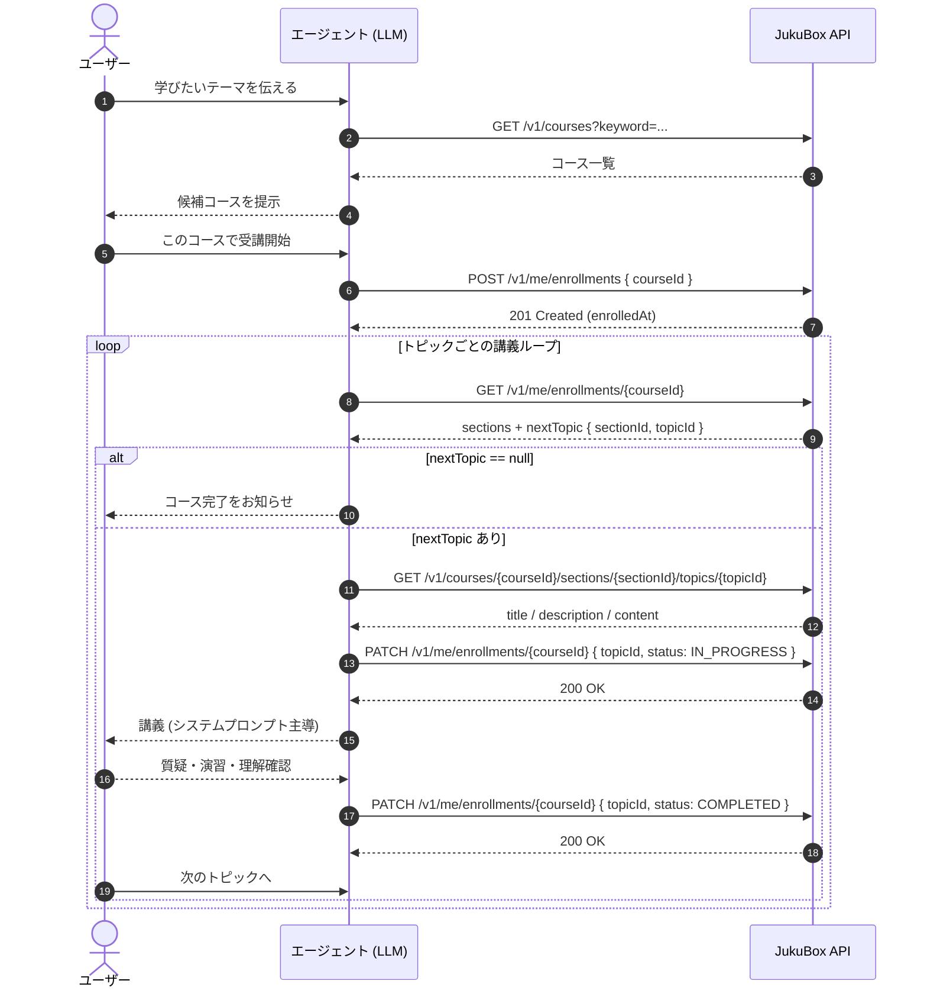

# 受講フロー (Learning Flow)

## 1. 概要

JukuBox の受講体験は **ユーザー** と **エージェント (LLM クライアント)** の協調で進みます。本ドキュメントは、コース検索からトピック完了までの API 呼び出し順序を 1 枚で俯瞰するためのものです。

各エンドポイントの仕様は個別ドキュメントを参照してください:

- [コース一覧.md](./コース一覧.md) — `GET /v1/courses`
- [受講開始.md](./受講開始.md) — `POST /v1/me/enrollments`
- [受講中一覧.md](./受講中一覧.md) — `GET /v1/me/enrollments`
- [受講中詳細.md](./受講中詳細.md) — `GET /v1/me/enrollments/{courseId}`
- [トピック詳細.md](./トピック詳細.md) — `GET /v1/courses/{courseId}/sections/{sectionId}/topics/{topicId}`
- [受講進捗更新.md](./受講進捗更新.md) — `PATCH /v1/me/enrollments/{courseId}`
- [認証.md](./認証.md)

---

## 2. 登場ロール

| ロール       | 役割                                                                                       |
| :----------- | :----------------------------------------------------------------------------------------- |
| ユーザー     | 学びたい内容を伝える / コースを選ぶ / 「次に進めて」「分からない」など意思決定を行う。     |
| エージェント | LLM クライアント (Claude Code 等)。 API を呼んで講義テキストを読み込み、ユーザーに教える。 |
| API          | JukuBox バックエンド。受講状態・コース構造・トピック本文を保持する。                       |

---

## 3. シーケンス図

---

## 4. 各ステップの解説

### 4.1. コース検索

- ユーザー: 学びたいテーマをエージェントに伝える。
- エージェント: [コース一覧](./コース一覧.md) (`GET /v1/courses`) を `keyword` 付きで呼び出し、候補をユーザーに提示。 `cursor` でページング可。

### 4.2. 受講開始

- ユーザーが受講したいコースを選ぶ。
- エージェント: [受講開始](./受講開始.md) (`POST /v1/me/enrollments`) で Enrollment を作成。同コースを既に受講中なら `409 ALREADY_ENROLLED` が返るが、その場合も以降のループにそのまま進める。

### 4.3. 現在地の取得 (ループ起点)

- エージェント: [受講中詳細](./受講中詳細.md) (`GET /v1/me/enrollments/{courseId}`) を呼び、 **`nextTopic`** を確認する。
  - `nextTopic` が **「次に学ぶべきトピックの唯一の正規ソース」**。クライアント側でステータスを再計算しない。
  - `null` の場合はコース内に学ぶべき残りトピックが無い (= 全完了、もしくはコースに 1 件もトピックが無い)。

### 4.4. トピック本文の取得

- エージェント: `nextTopic.sectionId` / `nextTopic.topicId` をそのまま [トピック詳細](./トピック詳細.md) (`GET /v1/courses/.../topics/...`) に渡し、 `title` / `description` / `content` を取得。
- 取得した `content` を学習の知識ソースとして読み込む。

### 4.5. 学習開始の宣言

- エージェント: [受講進捗更新](./受講進捗更新.md) (`PATCH /v1/me/enrollments/{courseId}`) を `status: "IN_PROGRESS"` で呼ぶ。
- これによりサーバー側の進捗レコードが「学習中」に更新され、 `受講中詳細` の `nextTopic` が同じトピックを指し続けるようになる (中断・再開時の指標)。

### 4.6. 講義 (システムプロンプト主導)

- エージェント: 取得済み `content` を元に、ユーザーへ説明 / 質問 / 例題 / 確認を進める。具体的な対話設計はエージェント側のシステムプロンプトに委ね、本 API 仕様の対象外。

### 4.7. 学習完了の宣言

- エージェント: 理解確認が取れたら [受講進捗更新](./受講進捗更新.md) を `status: "COMPLETED"` で呼ぶ。
- `COMPLETED` から `IN_PROGRESS` への巻き戻しは API 側で禁止 (`400 INPUT_VALIDATION_ERROR`) なので、確実に完了したと判断できてから呼ぶこと。

### 4.8. 次トピックへ (ループ)

- ユーザーが「次へ」を希望したら [4.3 現在地の取得](#43-現在地の取得-ループ起点) に戻る。
- `nextTopic` が `null` になったらコース完了をユーザーに伝える。

---

## 5. 認証

すべての受講系 API は API キー (Bearer) 認証で保護されています。詳細は [認証.md](./認証.md) を参照してください。
